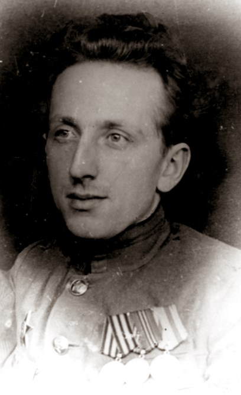
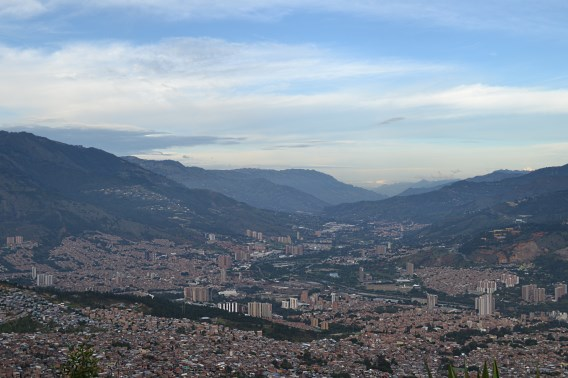

---
# about.md
title:   Hello Everyone! &mdash; Eh, Quiai?
updated: 2020-01-07
---

<aside markdown="1" class="right">

I dedicate this project to my grandfather, Konstantin S. Boikatchev, the most intelligent individual I have ever met in person. I am sure he would be proud of
me because of this work.  
  -- *Alexey Protasov (AKA rusini)*

<figure></figure>

(On 2020-01-06 he would turn 100!)

</aside>



<figure></figure>

My name is Alex Protasov (AKA rusini). I've been programming since I was 12 and often, when I was stuck with some problem, I was coming to ideas about solving
the problem either via a programming paradigm shift or a simple change of notation. Thus, programming languages have been always my passion and I've been always
dreaming about sharing this experience and offering my own software development tools. MANOOL is a pinnacle of those hopes, but what I didn't know is how
complex it was actually going to be ...

At some time in the past I
  * worked for two multinational corporations in the area of compilers (Intel and Sun Microsystems),
  * had a shareware visual programming tool,
  * taught compilers and the theory of formal languages at a university, and
  * had an IT Director position (where I acquired strong Linux server deployment skills).

I have an academic degree of MS of Computer Science, although I have reasons to not believe at all in the formal education system.

I'm a Russian expat (from Saint Petersburg) and live in the beautiful City of the Eternal Spring, Medell&iacute;n, Colombia, South America. My everyday language
is Spanish, my lingua franca is English, and my mother tongue is Russian. I also understood Portuguese and Italian quite well once in the past.

When I'm not working on MANOOL, I like swimming, traveling, and dancing (Salsa, Porro, Merengue, Cumbia, etc.).



<aside>
  <figure>
    
    <figcaption>&mdash; Medell&iacute;n &mdash; Colombia</figcaption>
  </figure>
</aside>
